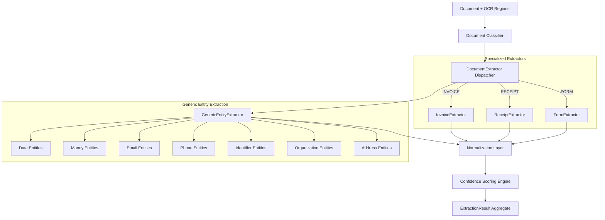

# DocuMind AI — Structured Field & Entity Extraction Subsystem

## Overview

The **Structured Field & Entity Extraction Subsystem** (`src/extraction/`) is responsible for converting raw OCR text and bounding-box geometry into strongly typed, normalized, and provenance-tracked key-value fields and generic entities.

The subsystem operates downstream of the **Document Classifier** (`src/classification/`), dispatching documents to specialized schema extractors while running generic entity recognizers across all document pages.

---

## Core Engineering Principles

1. **Physical Provenance Preservation**: Every extracted field links back directly to its origin (`document_id`, `page_number`, `source_text`, `bounding_box`, and `source_ocr_confidence`).
2. **Confidence Separation**:
   - `source_ocr_confidence`: Optical character recognition quality reported by the OCR engine (e.g. Tesseract).
   - `extraction_confidence`: Semantic and structural confidence calculated by extraction scoring rules.
   - `validation_status`: Downstream business and arithmetic validation status.
3. **Data Normalization vs Raw Fidelity**: The original OCR string is preserved verbatim in `raw_value` and `source_text`, while `normalized_value` stores typed representations (`float`, `ISO-8601 date string`, `normalized phone`, etc.).
4. **Candidate & Ambiguity Tracking**: When multiple candidate values compete (e.g. multiple dates on an invoice), all candidates are retained in `ExtractionCandidate` records and marked with `is_ambiguous=True` if confidence scores are within margin.
5. **Deterministic & Explainable**: No opaque LLM hallucination or fabricated scores. Every extraction decision is grounded in spatial proximity, pattern validity, and label matching strength.

---

## Architecture Diagram



---

## Module Layout

| Module | Purpose |
|---|---|
| `src/extraction/models.py` | Data models: `ExtractedField`, `ExtractedEntity`, `ExtractionCandidate`, `ExtractionResult`, `EntityType`. |
| `src/extraction/patterns.py` | Pre-compiled regular expressions and canonical label dictionaries for invoices, receipts, and forms. |
| `src/extraction/normalizers.py` | Data normalization for monetary values, dates (with ambiguity detection), emails, phones, and identifiers. |
| `src/extraction/spatial.py` | 2D geometric layout matching, line-based parsing, bounding-box envelopes, and spatial proximity heuristics. |
| `src/extraction/confidence.py` | 5-factor explainable extraction confidence calculation formula. |
| `src/extraction/entity_extractors.py` | `GenericEntityExtractor` for universal named and typed entity discovery. |
| `src/extraction/invoice_extractor.py` | `InvoiceExtractor` for commercial invoice schemas. |
| `src/extraction/receipt_extractor.py` | `ReceiptExtractor` for POS and retail receipts. |
| `src/extraction/form_extractor.py` | `FormExtractor` for structured intake and application forms. |
| `src/extraction/base.py` | Abstract base classes (`BaseDocumentExtractor`, `BaseFieldExtractor`, `BaseEntityExtractor`). |
| `src/extraction/extractor.py` | `DocumentExtractor` coordinator and classification-driven dispatcher. |

---

## Supported Fields by Document Category

### 1. Invoices (`INVOICE`)
- `invoice_number` (`FieldType.IDENTIFIER`)
- `invoice_date` (`FieldType.DATE`)
- `due_date` (`FieldType.DATE`)
- `vendor_name` (`FieldType.ORGANIZATION`)
- `vendor_address` (`FieldType.ADDRESS`)
- `customer_name` (`FieldType.ORGANIZATION`)
- `customer_address` (`FieldType.ADDRESS`)
- `subtotal` (`FieldType.CURRENCY`)
- `tax` (`FieldType.CURRENCY`)
- `total` (`FieldType.CURRENCY`)
- `currency` (`FieldType.STRING`)
- `payment_terms` (`FieldType.STRING`)
- `purchase_order_number` (`FieldType.IDENTIFIER`)
- `tax_id` (`FieldType.IDENTIFIER`)

### 2. Receipts (`RECEIPT`)
- `merchant_name` (`FieldType.ORGANIZATION`)
- `merchant_address` (`FieldType.ADDRESS`)
- `receipt_number` (`FieldType.IDENTIFIER`)
- `transaction_date` (`FieldType.DATE`)
- `transaction_time` (`FieldType.STRING`)
- `cashier` (`FieldType.STRING`)
- `terminal_id` (`FieldType.STRING`)
- `subtotal` (`FieldType.CURRENCY`)
- `tax` (`FieldType.CURRENCY`)
- `total` (`FieldType.CURRENCY`)
- `payment_method` (`FieldType.STRING`)
- `currency` (`FieldType.STRING`)

### 3. Forms (`FORM`)
- `applicant_name` (`FieldType.STRING`)
- `first_name` / `last_name` (`FieldType.STRING`)
- `date_of_birth` (`FieldType.DATE`)
- `phone` (`FieldType.PHONE`)
- `email` (`FieldType.EMAIL`)
- `address` (`FieldType.ADDRESS`)
- `form_number` (`FieldType.IDENTIFIER`)
- `signature_indicator` (`FieldType.BOOLEAN`)

---

## Spatial Layout Heuristics

1. **Inline Colon & Separator Parsing**: Matches key-value pairs formatted on the same textual line separated by `:`, `#`, `-`, or `=`.
2. **Adjacent Horizontal Pairing**: Locates label OCR bounding boxes and queries rightward within horizontal distance threshold (`max_horizontal_gap_px = 350px`) and vertical alignment margin (`same_line_tolerance_px = 12px`).
3. **Vertically-Below Pairing**: For form grids where labels sit directly above empty value lines (`max_vertical_gap_px = 60px`, `align_tolerance_px = 20px`).
4. **Bounding Box Envelope Merging**: Combines word-level bounding boxes into unified phrase envelopes and calculates mean OCR confidence.

---

## Extraction Confidence Scoring Formula

Extraction confidence is calculated deterministically across 5 independent weighted factors:

$$\text{Confidence} = 0.35 \cdot S_{\text{label}} + 0.30 \cdot S_{\text{pattern}} + 0.15 \cdot S_{\text{spatial}} + 0.10 \cdot S_{\text{uniqueness}} + 0.10 \cdot S_{\text{ocr}}$$

- $S_{\text{label}}$: Match strength of the key label ($1.0$ for exact canonical keyword, $0.80$ for fallback).
- $S_{\text{pattern}}$: Syntactic validity of the extracted value (regex match score, checksum, date validity).
- $S_{\text{spatial}}$: Geometric layout quality ($1.0$ for inline/adjacent, scaled by pixel distance).
- $S_{\text{uniqueness}}$: Penalty for competing candidate ambiguity ($1.0$ if unique, $\frac{1}{\sqrt{N}}$ if multiple candidates).
- $S_{\text{ocr}}$: Average optical character recognition confidence from the OCR engine.

---

## CLI Diagnostics

Run extraction subsystem verification via:

```powershell
python run.py --check-extraction
```
