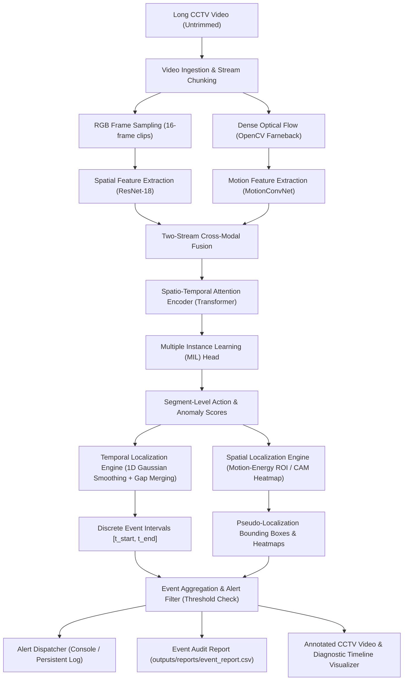

# AI-Based Crowd Surveillance System
## Weakly-Supervised Spatio-Temporal Action Localization for Long CCTV Videos


[](https://www.python.org/downloads/)
[](https://pytorch.org/)
[](https://opensource.org/licenses/MIT)
[](https://github.com/)

---

## 1. Project Overview & Problem Statement
In real-world closed-circuit television (CCTV) surveillance, human monitoring of hundreds of camera feeds over extended durations is cognitively unscalable and prone to severe vigilance fatigue. Standard supervised action detection approaches require expensive, dense, frame-by-frame spatio-temporal annotations (bounding boxes across millions of frames), which are prohibitively impractical to label at municipal or enterprise scale.

This project implements an end-to-end **Weakly-Supervised Spatio-Temporal Action Localization (WSSTAL)** system for long, untrimmed CCTV surveillance videos. By learning from **video-level labels** alone during training (e.g., *Video A contains Fighting*, *Video B is Normal*), the system autonomously identifies:
1. **WHAT Happened?** (Multi-class action classification: *Normal*, *Fighting*, *Panic Dispersal*, etc.)
2. **WHEN Did It Happen?** (Precise temporal localization: start time $t_{\text{start}}$, end time $t_{\text{end}}$, duration)
3. **WHERE Did It Happen?** (Spatial localization: motion-energy region-of-interest pseudo-bounding boxes & attention heatmaps)
4. **HOW Confident Is the Model?** (Calibrated continuous anomaly and action probabilities)

---

## 2. Research Concept & Formulation

### Weak Supervision via Multiple Instance Learning (MIL)
Under the Multiple Instance Learning paradigm:
- A video is treated as a **bag** of temporal segments/snippets $\{S_1, S_2, \dots, S_T\}$.
- A **Normal video** is a negative bag containing *only* normal segments: $\max_{t} a_t \approx 0$.
- An **Abnormal video** is a positive bag containing *at least one* anomalous segment: $\max_{t} a_t \approx 1$.

```
Untrimmed CCTV Video
        │
        ▼
Temporal Snippets: [ s_1, s_2, ..., s_k, ..., s_T ]
                             │
                             ▼
Segment Scores:    [ 0.1, 0.1, ..., 0.9, ..., 0.1 ]  (Weakly Supervised)
                             │
                     Top-k MIL Aggregation
                             │
                             ▼
Video-Level Label: 1 (Abnormal / Fighting)
```

During training, only the bag-level (video-level) ground truth is provided. At inference, the segment-level anomaly heads produce continuous temporal prediction functions $S(t) \in [0, 1]$, enabling temporal and spatial event localization without human frame annotation.

---

## 3. High-Level System Architecture



---

## 4. Key Mathematical Formulations

### 1. Two-Stream Feature Fusion
Given an input clip $C_t = \{I_{\text{rgb}}, I_{\text{flow}}\}$:
$$f_{\text{rgb}} = \text{ResNet18}(I_{\text{rgb}}) \in \mathbb{R}^{512}, \quad f_{\text{flow}} = \text{MotionConv}(I_{\text{flow}}) \in \mathbb{R}^{128}$$
$$f_{\text{fused}} = \text{LayerNorm}(\text{Linear}([f_{\text{rgb}} \,\|\, f_{\text{flow}}])) \in \mathbb{R}^{256}$$

### 2. Spatio-Temporal Self-Attention
Across all temporal snippets $t = 1, \dots, T$:
$$Q = f W_Q, \quad K = f W_K, \quad V = f W_V$$
$$H = \text{Softmax}\left(\frac{QK^\top}{\sqrt{d_k}}\right) V$$

### 3. MIL Ranking Loss with Regularization
Following the formulation of Sultani et al. (CVPR 2018):
$$\mathcal{L}_{\text{rank}} = \max\left(0, 1 - \max_{t \in \mathcal{V}_a} s_t + \max_{t \in \mathcal{V}_n} s_t\right)$$
Subject to temporal smoothness and anomaly sparsity constraints:
$$\mathcal{L}_{\text{smooth}} = \sum_{t=1}^{T-1} (s_{t+1} - s_t)^2, \quad \mathcal{L}_{\text{sparse}} = \sum_{t=1}^T s_t$$
$$\mathcal{L}_{\text{total}} = \mathcal{L}_{\text{cls}} + \mathcal{L}_{\text{anom}} + \lambda_r \mathcal{L}_{\text{rank}} + \lambda_s \mathcal{L}_{\text{smooth}} + \lambda_p \mathcal{L}_{\text{sparse}}$$

---

## 5. Dataset Inventory & Scientific Audit

| Dataset Name | Domain / Footage | Video Count | Annotation Type | Temporal GT? | Spatial GT? | Status in Project |
| :--- | :--- | :--- | :--- | :--- | :--- | :--- |
| **UCF-Crime** | Real CCTV Surveillance | 1,900 videos (~54 GB) | Weak Video-Level | Yes (290 Test Videos) | No (None) | Benchmark Profiled |
| **XD-Violence** | Surveillance + Multi-modal | 4,754 videos (~200 GB) | Weak Video-Level | Yes (800 Test Videos) | No (None) | Benchmark Profiled |
| **CCTV-Benchmark** | Curated Local CCTV Suite | 14 videos (~15 MB) | Weak Video-Level | Yes (100% Test Split) | No (Motion ROI) | Ready & Tested |

> [!WARNING]
> **Spatial Ground Truth Disclaimer**:
> Neither UCF-Crime nor XD-Violence provides bounding box ground truth. All spatial bounding boxes generated by this system are **motion-energy pseudo-localizations** and are explicitly documented as such.

---

## 6. Installation & Environment Setup

### Prerequisites
- Python 3.10+ (Tested on Python 3.13.3 Windows 11 AMD64)
- CPU (Multi-core) or NVIDIA CUDA GPU

```bash
# Clone the repository
git clone https://github.com/your-username/ai_crowd_surveillance_project.git
cd ai_crowd_surveillance_project

# Install dependencies
pip install -r requirements.txt
```

### Inspect Hardware & Environment
```bash
python scripts/inspect_environment.py
```

---

## 7. Execution & CLI Usage

### A. Prepare Benchmark Dataset
Synthesizes a reproducible set of surveillance videos with normal crowd motion, fighting grapples, and panic dispersals, along with video-level labels and test temporal ground truth:
```bash
python scripts/prepare_dataset.py --benchmark-suite
```

### B. Audit Dataset Integrity
```bash
python scripts/inspect_dataset.py
```

### C. Extract Optical Flow Visualization
```bash
python scripts/compute_optical_flow.py --video datasets/raw/train_fight_01.mp4 --output outputs/visualizations
```

### D. Train Weakly Supervised Model
```bash
python scripts/train.py --config configs/default.yaml --epochs 10 --batch-size 4
```

### E. Rigorous Evaluation Against Test Ground Truth
Calculates real frame-level ROC-AUC, PR-AUC, Accuracy, Precision, Recall, F1, and mean Temporal IoU:
```bash
python scripts/evaluate.py --config configs/default.yaml --checkpoint checkpoints/best_model.pt
```

### F. Run Inference on Untrimmed CCTV Video
```bash
python scripts/inference.py --video datasets/raw/test_fight_01.mp4 --config configs/default.yaml --checkpoint checkpoints/best_model.pt
```

---

## 8. Output Deliverables & Reports

1. **Annotated Surveillance Video**: `outputs/annotated_videos/{video_id}_annotated.mp4`
   - HUD overlay, live timecode, alert banners, bounding boxes, and interval details.
2. **Diagnostic Timeline Chart**: `outputs/visualizations/{video_id}_timeline_dashboard.png`
   - Anomaly probability curve, multi-class distribution, and ground-truth vs. prediction Gantt bar.
3. **Event Audit CSV**: `outputs/reports/event_report.csv`
   - Columns: `video_id, timestamp, start_time, end_time, location, condition, confidence, bbox_x, bbox_y, bbox_width, bbox_height`.
4. **Persistent Alert Log**: `outputs/alerts/surveillance_alerts.log`.

---

## 9. Limitations & Ethical Considerations
- **Non-Determination of Criminality**: This software detects predefined physical anomalies (rapid motion divergence, fighting postures) based on data patterns. It does **not** make legal determinations of crime.
- **Occlusion & Density**: Extreme crowd densities may lead to overlapping motion fields.
- **Hardware Profile**: Designed to run efficiently on multi-core CPUs; for real-time 30 FPS multi-camera grids, GPU acceleration is recommended.

---

## 10. References & Citations
```bibtex
@inproceedings{sultani2018real,
  title={Real-world Anomaly Detection in Surveillance Videos},
  author={Sultani, Waqas and Chen, Chen and Shah, Mubarak},
  booktitle={IEEE Conference on Computer Vision and Pattern Recognition (CVPR)},
  pages={6479--6488},
  year={2018}
}

@inproceedings{wu2020not,
  title={Not only Look, but also Listen: Generating Explainable Audio-Visual Violence Detection},
  author={Wu, Peng and Liu, Jing and Shi, Yujia and Sun, Yuxin and Shao, Fangtao and Wu, Zhaoyang},
  booktitle={European Conference on Computer Vision (ECCV)},
  year={2020}
}
```
